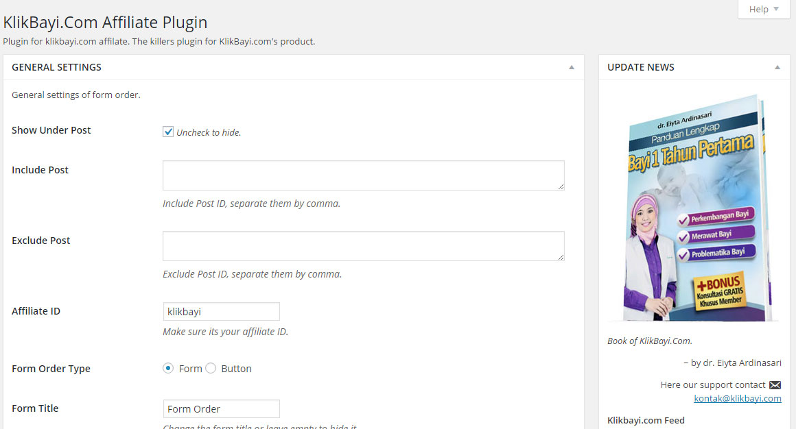
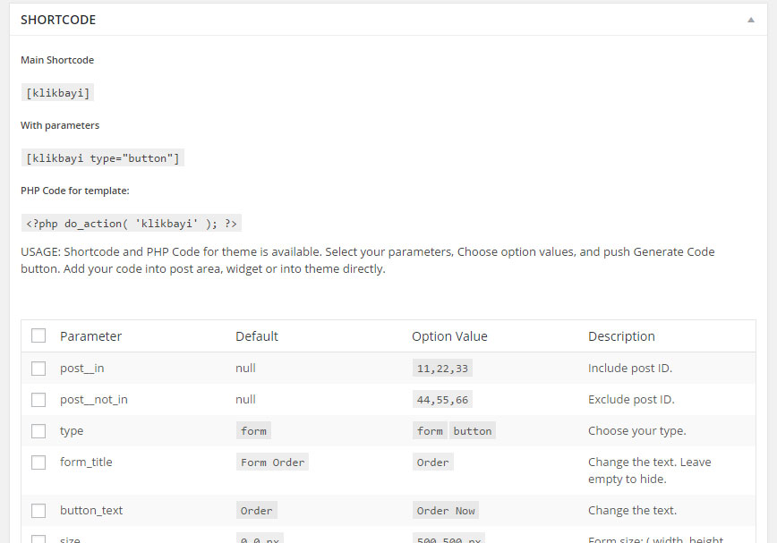
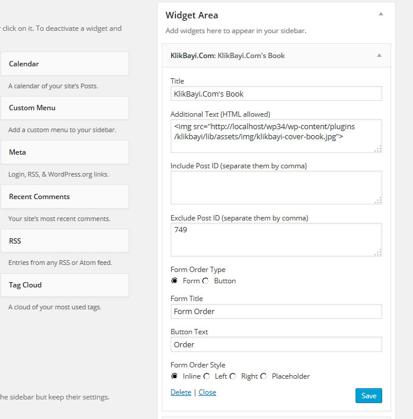

## Description
**Marketing Tool for KlikBayi Affiliate** plugin is created to support http://klikbayi.com/ affiliaters to selling klikbayi.com's product with embeded form or button order into Wordpress site. Settings configuration, Widget, Shortcode, and PHP Code for theme is available.

## Installation
1. Upload plugin zip contents to `wp-contents/plugin` directory and activate the plugin.
2. Go to `KlikBayi Affiliate` > `Settings`, set your affiliate ID, make some configuration if you need, and save your work.
3. You can insert shortcodes into administration posts area and widget text. Widget with configuration is available. If you need add php code into your theme, the generate PHP code is available too.

## Frequently Asked Questions
#### How do I setup my WordPress theme to work with Klik Bayi plugin

This plugin show the tool feature that embeded into your site automatically, and you can set up some configuration on settings admin. If you need, you can use php code `<?php do_action('klikbayi'); ?>` and add this single line code after the_content code. Single or sitewide pages is welcome. More advance code is available.

## Screenshots
1. Part of setting screenshot-1.jpg.

2. Part of shortcode generator screenshot-2.jpg.

3. KlikBayi Widget screenshot-3.jpg.

## Changelog
* 1.0.1 = October 26, 2015
 * Fix translation Bahasa Indonesia
 
* 1.0.0 = October 23, 2015
 * First official release!

## Upgrade Notice
* 1.0.0
 * This version fixes a security related bug. Upgrade immediately.